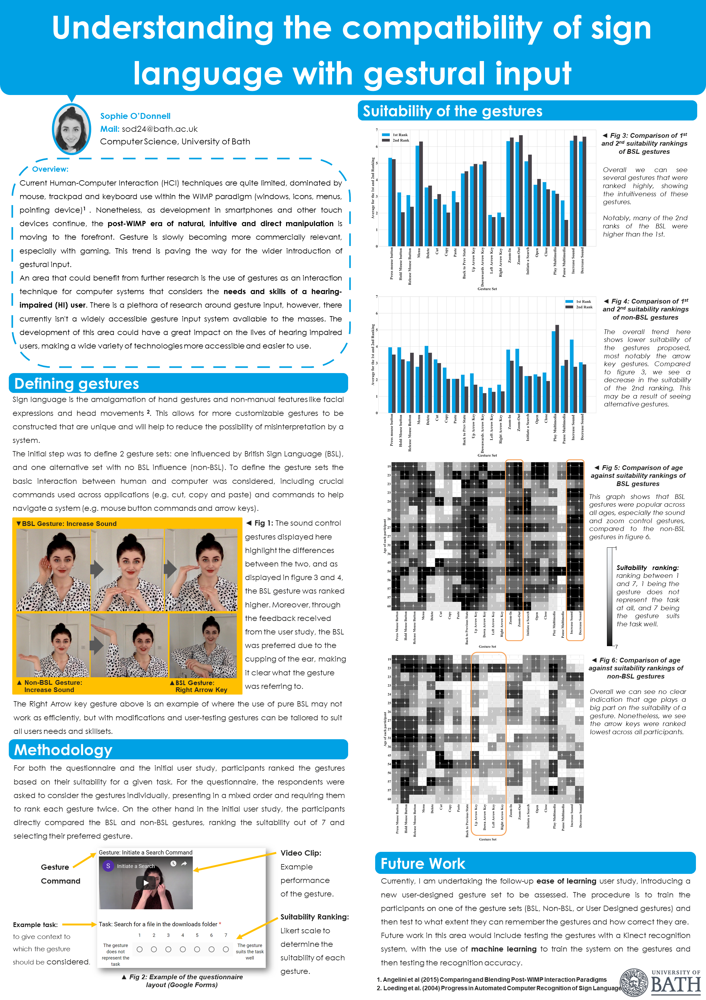

# BSCLovelace_Colloquium_Poster
Poster discussing the compatibility of sign language with gestural input.

Abstract:

This poster will examine how concepts from BSL can be applied to compiling a gesture set for high-level computer tasks. Gestural interaction is exceeding the boundaries of traditional mouse and keyboard-based tools. This emerging paradigm of hand movements and facial expressions has the potential to constitute a richer interaction modality. As we head into the post-WIMP era with more interaction capabilities available, these are diffusing rapidly into the market, especially with gaming and smartphones. In this work, we explore the use of concepts from BSL to design a gesture set for Human-Computer Interaction (HCI). We consider a wide range of users, including those with a hearing impairment, throughout the design stages. This is key to increasing accessibility in a fundamental way, not just through an add-on after implementation. We specifically focus on dynamic two-handed gestures inline with BSL. Through user studies comprising suitability testing of constructed gesture sets against the task they are aligned with, comparing a BSL gesture set against a general set. Results show a considerable preference for BSL gestures and little relation between participant's age and ranking of gesture suitability. We use the results and insights from the study relating to the effects of those designing the gestures, as well as the cognitive, articulatory and technological aspects, to propose a new framework for gesture design principles. Future work will introduce user-composed gestures and exploring ease of recall. The use of Machine Learning with the potential for personalised gestures will be an exciting area of expansion.
